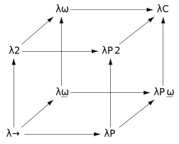

# Background and Foundations

The introduction promised a structural model of Rust's type system — a model built from the lambda cube, Reynolds' parametricity, and the Curry-Howard correspondence. This chapter lays the groundwork. It introduces the theoretical tools the rest of the book depends on, connects each one to concrete Rust, and establishes the vocabulary we will use throughout.

None of this requires prior knowledge of type theory, category theory, or formal logic. Every concept is introduced from first principles. But the concepts themselves are real mathematics, not simplified analogies, and they earn their keep: each one will illuminate something about Rust that the standard framing leaves opaque.

## Terms and Types

Before we can talk about relationships between terms and types, we need to be precise about what these words mean.

A **type** is a classification. In the simplest setting, it tells you what kind of thing you are dealing with: `i32` is a type, `String` is a type, `bool` is a type. But types can be far more than labels for data layout. A type can carry propositions (trait bounds), encode invariants (typestate), parameterise over unknown future types (generics), and assert relationships between types (associated types, where clauses). The richer the type system, the more a type can say.

A **term** is something that has a type — something that *inhabits* a type, in the formal vocabulary. The integer `42` is a term of type `i32`. The function `fn double(x: i32) -> i32 { x * 2 }` is a term of type `fn(i32) -> i32`. A closure, a struct instance, an enum variant — all terms.

In the type theory literature, "term" is the universal word for the things that types classify. In Rust, the natural word is "value": you speak of a value of type `i32`, a value of type `String`, the return value of a function. As discussed in the Introduction, this book follows Rust's convention in most contexts — but in this chapter, where we engage directly with formal frameworks, we will use "term" in its standard type-theoretical sense. The mapping is straightforward: what type theory calls a term, Rust calls a value (when evaluated) or an expression (when unevaluated). The distinction will matter when we reach the fourth axis of the lambda cube, where the question is precisely whether runtime values — terms — can appear inside types.

With these definitions in hand, we can state the central question that organises this chapter: *what relationships between terms and types does a given type system permit?*

## Barendregt's Lambda Cube

In 1991, Henk Barendregt introduced the **lambda cube** — a framework that classifies type systems along three independent axes of dependency. Each axis represents a relationship between terms and types that a system may or may not allow. By combining these axes, the cube identifies eight possible type systems, arranged as vertices of a three-dimensional cube.

The lambda cube begins from a common origin: the **simply typed lambda calculus** (λ→), a system where terms depend on terms and nothing else. Ordinary functions live here — a function takes a term and returns a term, and types are fixed, ground, and never parameterised. From this origin, three axes extend:

### Axis 1: Terms Depending on Types (Polymorphism)

This axis introduces **parametric polymorphism** — the ability for a term (a function, a value) to be parameterised by a type. Moving along this axis takes us from λ→ to **System F** (λ2), Jean-Yves Girard and John Reynolds' polymorphic lambda calculus.

In Rust, this axis is generics:

```rust
fn identity<T>(x: T) -> T {
    x
}
```

The function `identity` is a term that depends on a type `T`. It does not have a single fixed type like `fn(i32) -> i32`; instead, it has a *family* of types, one for each instantiation of `T`. In the formal notation of System F, its type would be written ∀T. T → T — a universally quantified type.

Rust inhabits this axis fully. Every generic function, every generic struct, every generic enum is a term depending on a type. This is so fundamental to Rust that it is easy to forget it represents a genuine step beyond what the simply typed lambda calculus can express. Languages like C (before `_Generic`) had no mechanism for terms to depend on types at all — every function had a fixed, concrete signature.

### Axis 2: Types Depending on Types (Type Operators)

This axis introduces **type constructors** — the ability for a type to be parameterised by another type. Moving along this axis takes us from λ→ to **λω̲** (lambda omega underbar), a system with type-level functions.

In Rust, this is what `Vec`, `Option`, `Result`, and every generic struct or enum definition represents:

```rust
struct Pair<A, B> {
    first: A,
    second: B,
}
```

`Pair` is not a type. It is a *type operator* — a function at the type level that takes two types as arguments and produces a type as its result. `Pair<i32, String>` is a type. `Pair<bool, bool>` is a different type. `Pair` itself is a function Type × Type → Type.

Rust's trait system also operates on this axis. A trait with an associated type defines a type-level function:

```rust
trait Iterator {
    type Item;
    fn next(&mut self) -> Option<Self::Item>;
}
```

For any type `T` implementing `Iterator`, the associated type `T::Item` is computed from `T` — it is a type that depends on another type.

Rust inhabits this axis fully. Every generic type definition is a type operator. Every associated type is a type-level function. Combined with Axis 1 (terms depending on types), Rust reaches **System Fω** — the corner of the lambda cube that has both polymorphism and type operators.

### Axis 3: Types Depending on Terms (Dependent Types)

This axis introduces **dependent types** — the ability for a type to be parameterised by a runtime value. Moving along this axis takes us from λ→ to **λΠ** (lambda Pi), the simplest dependently typed system.

This is the axis where Rust mostly stops.

In a fully dependently typed language like Idris or Agda, you can write types that mention specific values:

```text
-- Idris: a vector type indexed by its length
data Vect : Nat -> Type -> Type where
    Nil  : Vect 0 a
    (::) : a -> Vect n a -> Vect (n + 1) a
```

Here, the type `Vect 3 Int` is different from `Vect 5 Int` — the *length*, a runtime value, appears in the type. The type system tracks the length through every operation: concatenating a `Vect 3 Int` and a `Vect 2 Int` produces a `Vect 5 Int`, and this is checked at compile time.

Rust cannot do this in general. But it has one narrow channel: **const generics**.

```rust
struct Buffer<const N: usize> {
    data: [u8; N],
}

impl<const N: usize> Buffer<N> {
    fn zeroed() -> Self {
        Buffer { data: [0; N] }
    }
}
```

Here, `N` is a value — a `usize` — that appears in a type. `Buffer<8>` and `Buffer<16>` are different types. The constant `N` flows from the value world into the type world, influencing the type's structure (the array length). This is dependent typing, restricted to a small set of types (`usize`, `bool`, `char`, and other scalar types) and a limited set of operations. Rust's nightly compiler extends this further with `generic_const_exprs`, allowing type-level arithmetic like `Buffer<{ A + B }>` — but even stable const generics represent a genuine, if constrained, excursion along the dependent type axis.

Const generics are, in the language of the lambda cube, a *pinhole* into the dependent type axis — enough to express fixed-size arrays, const-parameterised algorithms, and certain compile-time computations, but far short of the full power of λΠ.

### The Cube

Combining these three axes yields eight possible type systems. The lambda cube arranges them as vertices of a cube:



Reading this diagram:
- Axes
  - bottom-to-top Axis 1: adds Polymorphism
  - front-to-back Axis 2: adds Type Operators
  - left-to-right Axis 3: adds Dependent Types

- Vertexes
  - **λ→** (front-bottom-left): Simply typed lambda calculus. Terms depend on terms. Nothing else. This is Level 0 of our model.
  - **λ2** (front-top-left): System F. Terms also depend on types (polymorphism). This is Level 1.
  - **λω̲** (back-bottom-left): Type operators only. Types depend on types, but no polymorphism.
  - **λω** (back-top-left): System Fω. Polymorphism plus type operators. **This is approximately where Rust lives** — the combination of Levels 1, 2, and 4 in our model.
  - **λP** (front-bottom-right): Simple dependent types. Types depend on terms.
  - **λP2** (front-top-right): Polymorphism plus dependent types.
  - **λPω̲** (back-bottom-right): Type operators plus dependent types.
  - **λC = λP2ω** (back-top-right): The **Calculus of Constructions** — all three axes simultaneously. This is the system underlying Coq and Lean. Idris and Agda extend it further with universe polymorphism and other features.


Rust occupies λω — the back-top-left vertex — with const generics providing a narrow vertical channel into the dependent type dimension. The orphan rule, coherence, and monomorphisation are all consequences of *how* Rust inhabits this position: it commits to full erasure at the boundary, which is a choice that λω permits but does not require.

### The Fourth Dependency

The three axes of the lambda cube are often described as three of the four possible dependency relationships between terms and types:

| Dependency | Axis | Calculus | Rust |
|---|---|---|---|
| Terms depending on terms | (baseline) | λ→ | Ordinary functions |
| Terms depending on types | Axis 1 | λ2 | Generics: `fn f<T>(...)` |
| Types depending on types | Axis 2 | λω̲ | Type constructors: `Vec<T>` |
| Types depending on terms | Axis 3 | λP | Const generics (limited) |

The "fourth dependency" — terms depending on terms — is so basic that it is not considered an axis at all. It is the baseline from which everything else extends. Every programming language with functions has it. It is simply the ability to write `fn add(a: i32, b: i32) -> i32`.

But notice the asymmetry: Rust has full support for the first two axes and almost none for the third. This is not an accident. Full dependent types — types depending on terms — require that the boundary between compile time and runtime become permeable in both directions. Values must be lifted into the type level, and type-level computation must be able to reason about arbitrary runtime values. Rust's commitment to zero-cost abstraction and full erasure at the boundary makes this structurally incompatible with its design. The boundary is the reason Rust stops where it does in the lambda cube.

## Reynolds' Contributions

John C. Reynolds (1935–2013) made several contributions to the theory of programming languages that directly underpin this book's model. Where Barendregt's lambda cube gives us the axes, Reynolds gives us the content — the theorems that tell us what each position in the cube actually *means* for the programs we write.

### Definitional Interpreters (1972)

In "Definitional Interpreters for Higher-Order Programming Languages," Reynolds drew a distinction that foreshadows this book's central structural device: the distinction between the **object language** (the language being defined) and the **meta-language** (the language used to define it).

When you write a Rust program, you are working in the object language. The compiler `rustc` is a meta-language program that interprets, transforms, and ultimately translates your Rust code into machine instructions. The boundary between 𝒯 and 𝒱 is, in Reynolds' terms, the boundary between a type-level meta-language that reasons about programs and a runtime language that executes them.

Reynolds showed that the evaluation strategy of the meta-language (whether it evaluates arguments before or after passing them to functions) determines the semantics of the object language. This observation maps directly onto Rust's monomorphisation strategy: the compiler's choice to fully specialise generic functions at compile time is an evaluation strategy for the type-level meta-language. It fully evaluates type-level expressions before crossing the boundary. The alternative — preserving type abstraction at runtime via dictionary-passing, as Haskell does — is a different evaluation strategy for the same meta-language, yielding different performance characteristics and a different relationship to the boundary.

### System F and Parametric Polymorphism (1974)

Reynolds independently discovered System F (Girard had discovered it earlier, in 1972, in the context of proof theory). In "Towards a Theory of Type Structure," Reynolds gave the first semantic treatment of polymorphism: what it *means* for a function to have the type ∀T. T → T.

The answer is parametricity: a function of type ∀T. T → T must behave uniformly for all types. It cannot inspect `T`, cannot branch on what `T` is, cannot use any property of `T` whatsoever. The only thing it can do with a value of type `T` is return it unchanged. Therefore, the only function with this type is the identity function.

This is the foundation of Level 1 in our model. In Rust:

```rust
fn identity<T>(x: T) -> T {
    x
}
```

The signature `<T>(T) -> T` admits exactly one implementation (up to observational equivalence). You cannot write a function with this signature that does anything other than return its argument. The type alone determines the behaviour — not because of a language restriction, but because of a mathematical theorem.

Reynolds' parametricity theorem generalises this. For any polymorphic type, parametricity constrains the possible implementations. Philip Wadler later popularised this as "theorems for free" — theorems that follow purely from a function's type signature, without examining its implementation. We will develop this fully in Chapter 4.

### Representation Independence (1978)

In "On the Relation Between Direct and Continuation Semantics" and subsequent work, Reynolds developed the concept of **representation independence**: if two implementations of an abstract type are related by a suitable simulation, then no program can distinguish them.

This is the formal justification for Rust's coherence rules. When Rust requires that there be at most one `impl` of a given trait for a given type — the coherence condition enforced by the orphan rule — it is ensuring representation independence. If two different `impl Ord for MyType` blocks could coexist, a program's behaviour might depend on *which* implementation was selected, violating the principle that the choice of representation should be unobservable.

Representation independence is the Level 3 guarantee. It says that proof witnesses (impl blocks) are interchangeable as long as they satisfy the same specification — and Rust's coherence rules ensure this by making the question moot: there is only ever one witness, so there is nothing to interchange.

### Relational Parametricity (1983)

In "Types, Abstraction, and Parametric Polymorphism," Reynolds formalised parametricity using *relations*. The key insight: a polymorphic function does not merely operate uniformly on all types — it preserves all *relations* between types.

To understand what this means, consider a function `f: ∀T. Vec<T> → Vec<T>`. Parametricity says that for any two types `A` and `B` and any relation `R` between them, if you apply `R` element-wise to a `Vec<A>` to get a `Vec<B>`, then applying `f` before or after the relational mapping gives the same result. In other words, `f` commutes with all structure-preserving transformations of its type parameter.

What does this tell us? It tells us that `f` can reorder, duplicate, or drop elements — but it cannot manufacture new elements or inspect them. It can only shuffle the container structure. The *type* of the function — `∀T. Vec<T> → Vec<T>` — constrains its behaviour to a specific class of operations, purely through the relational parametricity theorem.

In our model, relational parametricity formalises the boundary between Level 1 and Level 2. At Level 1 (unconstrained parametric polymorphism), a function must preserve *all* relations on its type parameter — it knows nothing about the parameter, so it cannot violate any relation. At Level 2 (constrained polymorphism, `T: Bound`), the function need only preserve relations *consistent with the bound*. The bound restricts the class of relations, which is equivalent to widening the class of permitted implementations. More constraints on `T` means more operations on `T`, which means more possible implementations, which means fewer "free theorems."

### Defunctionalisation (1972)

In the same landmark 1972 paper on definitional interpreters, Reynolds introduced **defunctionalisation**: a program transformation that eliminates higher-order functions by replacing closures with data structures and dispatch.

The transformation works as follows: every closure in a program is replaced by a variant of a sum type (an enum), carrying the closure's captured environment as data. Every application site is replaced by a match on this sum type, dispatching to the appropriate code. The result is a first-order program — no closures, no function pointers, just data and pattern matching.

This is directly relevant to Rust in two ways.

First, Rust's enum-and-match pattern is *manual defunctionalisation*:

```rust
enum Shape {
    Circle(f64),
    Rectangle(f64, f64),
}

fn area(shape: &Shape) -> f64 {
    match shape {
        Shape::Circle(r) => std::f64::consts::PI * r * r,
        Shape::Rectangle(w, h) => w * h,
    }
}
```

This is a defunctionalised representation of what, in a higher-order style, might be a collection of closures each capturing their own dimensions and computing an area. The enum variants are the closure representations. The match is the dispatch.

Second, `dyn Trait` is *automatic defunctionalisation performed by the compiler*. A `dyn Trait` object is a pair of a data pointer (the captured environment) and a vtable (the dispatch table). The vtable is the reified sum type; dynamic dispatch is the match.  This is closely analogous to Reynolds' transformation, applied at the boundary: the compiler takes the higher-order type-level structure (a trait with methods) and lowers it into a first-order runtime representation (a vtable and a pointer). The analogy is not exact — Reynolds' defunctionalisation replaces closures with a single sum type, while `dyn Trait` creates a vtable per trait — but the structural correspondence is clear.

In the language of our model, defunctionalisation is the forgetful functor F: 𝒯 → 𝒱 made explicit as a code transformation. It shows, concretely, what the boundary *does* to type-level abstractions when they must survive into runtime.

## The Type Lattice

Rust's trait bounds form a mathematical structure called a **lattice** — a partially ordered set where every pair of elements has a greatest lower bound (meet) and a least upper bound (join). Understanding this structure clarifies how bounds interact and what it means to add or remove constraints.

### Partial Order on Bounds

Consider three trait bounds: `Clone`, `Ord`, and `Clone + Ord`. There is a natural ordering among them:

- `Clone + Ord` is **more constrained** than either `Clone` or `Ord` alone. Fewer types satisfy `Clone + Ord` than satisfy `Clone` (because every type satisfying the compound bound must satisfy both). But functions bounded by `Clone + Ord` can do *more* — they have access to both cloning and ordering operations.

- The unconstrained parameter `T` (with no bounds at all) is the **least constrained** position. Every type satisfies "no bounds." But a function with no bounds on `T` can do almost nothing with `T` — only move, store, and return it.

This gives us a partial order on the space of bounds:

```text
         (no bounds)          ← least constrained, fewest operations
          /       \
       Clone      Ord
          \       /
       Clone + Ord            ← more constrained, more operations
          |
    Clone + Ord + Hash
          |
         ...
          |
       concrete type          ← fully constrained, all operations
```

The ordering is: bound A ≤ bound B if every type satisfying B also satisfies A. In lattice terms, moving *down* adds constraints (intersects predicate regions), narrows the set of qualifying types, and expands the available operations. Moving *up* removes constraints, widens the set of qualifying types, and restricts the available operations.

This is a precise inversion of the usual intuition. More constraints mean *fewer* types but *more* power. Fewer constraints mean *more* types but *less* power. The programmer's task, when designing a generic interface, is to find the right altitude in this lattice: constrained enough to do the job, unconstrained enough to admit the broadest useful set of types.

### Concrete Types as Bottom Elements

A fully concrete type — `i32`, `String`, `Vec<u8>` — sits at the bottom of the lattice. It satisfies all the bounds it satisfies (trivially), and it has a *specific* set of operations determined by its impl blocks. There is no further constraining to do; the type is fully determined.

In the language of our model, Level 0 (the value domain) consists of these bottom elements. They are the fully resolved points — no parameters, no quantification, no freedom. Ascending from Level 0 into Levels 1 and 2 means replacing these fixed points with regions of the lattice: a generic parameter `T: Ord` denotes not a single point but the *set of all types below `Ord`* in the lattice.

### The Lattice and the Levels

The lattice structure connects the levels as follows:

- **Level 0** works with specific points in the lattice (concrete types).
- **Level 1** works with the top of the lattice — the unconstrained region where `T` is entirely free.
- **Level 2** works with intermediate regions — bounded sublattices defined by trait predicates.
- **Level 3** provides the proof witnesses that a specific point (concrete type) actually lies within a given region (satisfies a given bound).

The lattice is, in effect, the geography of 𝒯. The levels tell you what kind of navigation you are performing.

## Fibrations: Generic Types as Families

A generic type in Rust is not a single type. It is a *family* of types, one for each value of the type parameter. This family structure has a precise mathematical name: a **fibration**.

Consider `Vec<T>`. For each concrete type `T` — `i32`, `String`, `bool`, and so on — there is a corresponding type `Vec<i32>`, `Vec<String>`, `Vec<bool>`. These concrete types are the **fibres** of the type constructor `Vec`. The type constructor itself is the **total space**, and the type parameter `T` ranges over the **base space** (the set of all types, or some subset defined by bounds).

```text
    Total space: Vec<_>
         |
         | fibre over i32:    Vec<i32>
         | fibre over String: Vec<String>
         | fibre over bool:   Vec<bool>
         | ...
         |
    Base space: { all types T }
```

A generic function operates on the total space. When you write:

```rust
fn first<T>(items: &[T]) -> Option<&T> {
    items.first()
}
```

you are defining a function that works *across all fibres simultaneously*. The single definition applies to `&[i32]`, `&[String]`, `&[bool]`, and every other instantiation. Parametricity (Level 1) says that this function must behave the same way on every fibre — it cannot distinguish one fibre from another.

When you add a bound — `fn sort<T: Ord>(items: &mut [T])` — you restrict the base space to those types satisfying `Ord`. The function now operates only on a *sub-fibration*: the fibres over orderable types. Within this restricted family, the function can exploit ordering — but it still cannot distinguish between specific fibres. It knows `T` is orderable but not *which* orderable type `T` is.

When the compiler monomorphises, it performs the inverse operation: it takes the total-space definition and generates code for each specific fibre that the program actually uses. The family collapses into a set of individual functions, one per fibre. This is the forgetful functor applied to the fibration structure: the family relationship is erased, leaving only its individual members.

The fibration viewpoint clarifies a common point of confusion. When a Rust programmer asks "what type is `Vec`?", the precise answer is: `Vec` is not a type; it is a type-level function. `Vec<i32>` is a type (a fibre). `Vec<T>` where `T` is bound by some trait is a sub-family (a sub-fibration). The generic parameter is the index into the family, and the bounds on the parameter determine which sub-family you are working with.

### Decomposing a Generic Function

A Rust function signature like `fn print_sorted<T: Ord + Display>(items: &mut [T])` reads as a single declaration, but it actually bundles three distinct structures that belong to different levels of our model:

1. **The parameter domain** (Level 2): the set of types `{ T | T: Ord + Display }` — a region of the type lattice. This determines *which* types the function can be instantiated with.

2. **The function family** (Levels 1–2): for each `T` in the parameter domain, a concrete function `&mut [T] → ()`. The domain and codomain may themselves depend on `T` — the family is indexed by the type parameter, which is the fibration structure described above.

3. **The proof witnesses** (Level 3): for each `T` in the parameter domain, there must exist an `impl Ord for T` and an `impl Display for T`. These are the evidence that a specific type actually belongs to the parameter domain. Without them, the function cannot be called at that type.

These three components are distinct mathematical objects, even though Rust's syntax collapses them into a single line. The parameter domain is a predicate on types. The function family is a fibred collection of concrete functions. The proof witnesses are the evidence that connects the two — they certify that a given type lies within the predicate region, enabling the corresponding fibre of the function family to be used.

The distinction matters because each component has a different fate at the boundary. The function family survives — monomorphisation generates a concrete function for each fibre. The parameter domain is consumed — the compiler uses it to determine which fibres to generate, then discards it. The proof witnesses are verified and erased — their computational content (the method implementations) is inlined into the generated code, but the proof objects themselves vanish.

The later chapters examine each component in its own right: Chapter 4 treats the function family (Level 1), Chapter 5 treats the parameter domain (Level 2), and Chapter 6 treats the proof witnesses (Level 3).

## The Two-Category Model

The introduction sketched the two categories 𝒯 and 𝒱 informally. Here we develop them with more precision, while remaining accessible to readers without category theory background.

A **category**, for our purposes, is a collection of objects and morphisms (arrows between objects) that can be composed. You already think in categories without knowing it: types and functions form a category (objects are types, morphisms are functions, composition is function composition). The category concept simply gives this structure a name and lets us reason about it abstractly.

### 𝒯 — The Type Category

The type category 𝒯 contains everything that exists at compile time:

**Objects in 𝒯:**
- Concrete types: `i32`, `String`, `Point`
- Generic type families: `Vec<T>`, `Option<T>`, `HashMap<K, V>`
- Trait bounds: `Ord`, `Clone + Display`, `Iterator<Item = u8>`
- Lifetime parameters: `'a`, `'static`
- Impl blocks: `impl Display for Point`, `impl<T: Ord> Ord for Vec<T>`

**Morphisms in 𝒯:**
- Generic function signatures (maps between type families)
- Subtyping relationships (lifetime subtyping: `'static: 'a`)
- Trait implementations as proof morphisms (connecting types to their trait obligations)
- Blanket impl derivations (if `T: Ord` then `Vec<T>: Ord`)

The internal structure of 𝒯 is the type lattice described above: bounds form a partial order, and the proof structure (Level 3) connects types to their positions in this lattice.

### 𝒱 — The Value Category

The value category 𝒱 contains everything that exists at runtime:

**Objects in 𝒱:**
- Concrete values: `42_i32`, `"hello".to_string()`, `Point { x: 1.0, y: 2.0 }`
- Monomorphised function code: the specific machine instructions for `sort::<i32>`
- Vtables: the dispatch tables for `dyn Display`
- Memory allocations: stack frames, heap blocks

**Morphisms in 𝒱:**
- Executable functions (concrete code that transforms values)
- Ownership transfers (moves)
- Borrows (shared and exclusive references)
- Memory operations (allocation, deallocation)

𝒱 has **affine structure**: morphisms carry resource constraints. A move is a morphism that consumes its source — the source value is no longer available after the morphism is applied. This is the borrow checker operating within 𝒱. From the categorical perspective, 𝒱 is not an ordinary category but an affine one, where morphisms may be used at most once.

### F: 𝒯 → 𝒱 — The Forgetful Functor

The forgetful functor F maps objects and morphisms of 𝒯 to objects and morphisms of 𝒱, preserving computational structure while erasing logical structure:

| 𝒯 (compile time) | F | 𝒱 (runtime) |
|---|---|---|
| Generic function family | → | Set of monomorphised functions |
| Trait bound `T: Ord` | → | (erased — verified and discarded) |
| Lifetime `'a` | → | (erased — no runtime presence) |
| `PhantomData<T>` | → | Zero-sized, no representation |
| `impl Trait for Type` | → | Inlined method code (static dispatch) |
| `dyn Trait` | → | Vtable pointer + data pointer |
| `const N: usize` | → | Literal value in generated code |

The functor is **forgetful** because it loses information: many distinct objects in 𝒯 map to the same object in 𝒱. For example:

```rust
struct Metres(f64);
struct Seconds(f64);
```

In 𝒯, `Metres` and `Seconds` are distinct types — they may have different trait implementations, different associated semantics, different positions in the type lattice. In 𝒱, after F is applied, both are identical: a single `f64` in memory. The type distinction — which prevents you from adding a distance to a time — exists only in 𝒯 and is erased by F.

This is the formal content of Rust's "zero-cost abstraction" principle: the newtype pattern costs nothing at runtime because the forgetful functor maps the newtype to its inner representation. The abstraction — the logical distinction between metres and seconds — lives entirely in 𝒯.

## The Phase Distinction

The boundary between 𝒯 and 𝒱 is not a concept invented for this book. It is a well-studied phenomenon in programming language theory, examined from several angles by different research traditions. Understanding these traditions clarifies what the boundary *is* and why it takes the form it does.

### Cardelli's Phase Distinction (1988)

Luca Cardelli, in work on the Quest language and modular programming, articulated the **phase distinction**: the principle that a programming language's semantics can be cleanly separated into a compile-time phase (type checking, module linking) and a runtime phase (computation, side effects), and that these phases should not interfere with each other.

The phase distinction is a design principle, not a mathematical necessity. Some languages violate it deliberately: Lisp-family languages blur the distinction through macros and `eval`; dependently typed languages dissolve it by allowing runtime values in types. Rust *embraces* the phase distinction aggressively — more aggressively than most languages — because its zero-cost abstraction guarantee depends on a clean separation. If type information leaked into runtime, it would have a cost.

In our model, Cardelli's phase distinction is the assertion that F: 𝒯 → 𝒱 is a *functor*, not merely a function — it preserves the categorical structure, mapping compile-time composition to runtime composition in a systematic way. The phases are distinct but formally connected.

### Harper, Mitchell, and Moggi's Phase Separation (1990)

Robert Harper, John Mitchell, and Eugenio Moggi formalised the phase distinction in their work on XML (a module calculus, unrelated to the markup language). They proved that for a certain class of type systems, it is possible to *separate* a program into a static (compile-time) part and a dynamic (runtime) part such that:

1. The static part can be computed without executing the program.
2. The dynamic part does not depend on the static part at runtime.
3. The separation preserves the program's meaning.

This is precisely the property that monomorphisation exploits. When Rust compiles a generic function, the "static part" (type parameters, trait bounds, lifetime annotations) is fully resolved at compile time. The "dynamic part" (the function body with types resolved) can execute without any reference to the static part. The separation is total: no runtime cost, no residual type information.

Harper et al.'s result tells us that this separation is *sound* — it does not change the program's meaning. The monomorphised version of `sort::<i32>` behaves identically to what the generic `sort::<T>` would produce if types were retained at runtime. The forgetful functor is meaning-preserving.

### Davies and Pfenning's Modal Analysis (2001)

Rowan Davies and Frank Pfenning offered a different perspective, framing the phase distinction through **modal logic**. In their analysis, compile time and runtime are *possible worlds* in the modal logic sense, connected by an accessibility relation:

- The **current world** is compile time — the world where type-level reasoning takes place.
- The **future world** is runtime — the world where computation takes place.
- A **necessity** operator (□) corresponds to values available at compile time (they are necessarily available at runtime too — constants, type information baked into code).
- A **possibility** operator (◇) corresponds to values that exist only at runtime (user input, I/O results, dynamically computed values).

In this framing, the functor F: 𝒯 → 𝒱 is the accessibility relation between worlds. The phase distinction says that you can access compile-time information at runtime (it has been baked in), but you cannot access runtime information at compile time (you have not yet entered that world). Dependent types partially invert this by allowing certain future-world values to be "pulled back" into the current world — which is precisely what const generics do in a limited way.

The modal framing is particularly illuminating for understanding lifetimes. A lifetime `'a` is a proposition about the future world (runtime): "this reference will be valid for this region of execution." The borrow checker verifies this proposition in the current world (compile time) using the rules of its sub-logic. The proposition is then erased by F — it has done its work. The future world never sees the proof, only the guarantee that the proof was valid.

### Three Framings, One Boundary

These three traditions — Cardelli's phase distinction, Harper et al.'s phase separation, Davies and Pfenning's modal worlds — are different descriptions of the same structural feature. This book uses the categorical framing (the forgetful functor) as its primary language because it composes naturally with the level structure and the lattice. But the reader should be aware that the same ideas have been formalised multiple times, from different starting points, and all three descriptions converge on the same insight: the boundary between compile time and runtime is not incidental to Rust's design. It is the central architectural decision from which everything else follows.

## Connecting the Foundations

Let us draw the threads together. The theoretical tools introduced in this chapter form a coherent structure:

**Barendregt's lambda cube** tells us *where* Rust sits in the space of possible type systems. Rust occupies the λω vertex (polymorphism plus type operators), with a pinhole into the dependent-type dimension via const generics. This position determines what Rust can express at the type level and what it cannot.

**Reynolds' work** tells us *what that position means*:
- Parametricity (Levels 1–2): the type signature alone constrains the implementation. The more polymorphic a function, the fewer things it can do.
- Representation independence (Level 3): proof witnesses are interchangeable. Coherence ensures uniqueness.
- Defunctionalisation (the boundary): type-level abstraction can be systematically lowered to runtime representation. `dyn Trait` is the canonical example.

**The type lattice** gives us the *geography* of the type category 𝒯. Trait bounds form a partial order. Generic parameters range over regions of this lattice. Concrete types are points. The programmer's task is to find the right altitude.

**Fibrations** give us the *structure* of generic types and functions. A generic type is a family indexed by its parameter. A generic function is a family of functions over that family. Monomorphisation collapses the family to its individual fibres.

**The two-category model** (𝒯 and 𝒱 connected by F) gives us the *architecture* of the whole system. Everything above the boundary is logical structure; everything below is computational behaviour. The boundary preserves behaviour and erases logic. Zero-cost abstraction is a property of this boundary.

**The phase distinction** gives us the *theoretical justification* for the boundary. The separation of compile time and runtime is sound, meaning-preserving, and deliberate. It is not a limitation of Rust's implementation but a design commitment.

The remaining chapters will use these tools to examine each level of the type hierarchy in detail. Chapter 2 introduces the Curry-Howard correspondence — the theorem that connects the entire structure to formal logic. Then Chapters 3 through 7 ascend the levels, each chapter building on the vocabulary established here.

The foundations are laid. Now we can build.
